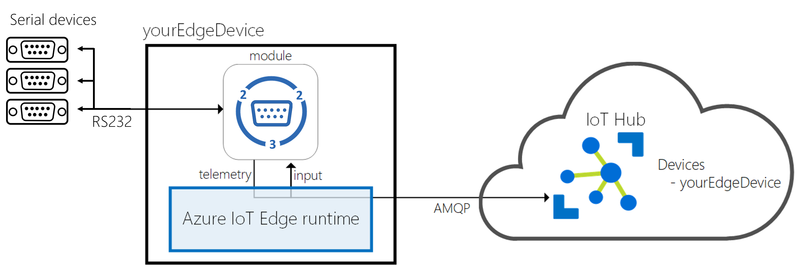

# Azure IoT Edge Serial Module

*This project has adopted the [Code of Conduct](CODE_OF_CONDUCT.md) from Contributor Covenant (https://www.contributor-covenant.org/) For more information contact ```jw + @ + jeeweetje.net``` with any additional questions or comments.*

```ascii
   _                         ___      _____   ___     _
  /_\   ___ _  _  _ _  ___  |_ _| ___|_   _| | __| __| | __ _  ___  
 / _ \ |_ /| || || '_|/ -_)  | | / _ \ | |   | _| / _` |/ _` |/ -_)
/_/ \_\/__| \_,_||_|  \___| |___|\___/ |_|   |___|\__,_|\__, |\___|
                                                        |___/
    ___            _        _   __  __          _        _
   / __| ___  _ _ (_) __ _ | | |  \/  | ___  __| | _  _ | | ___
   \__ \/ -_)| '_|| |/ _` || | | |\/| |/ _ \/ _` || || || |/ -_)  
   |___/\___||_|  |_|\__,_||_| |_|  |_|\___/\__,_| \_,_||_|\___|
```

## Azure IoT Edge Serial Port (RS232) Communication module for Linux & Windows

Using this module, developers can build Azure IoT Edge solutions with Serial (RS232) Port (the module is currently not available in Windows environment, please use Linux host + Linux container to play with the module) connectivity. The Serial module is an Azure IoT Edge module, capable of reading data from serial port devices and publishing data to the Azure IoT Hub via the Edge framework. Developers can modify the module tailoring to any scenario.



There are prebuilt Serial module container images ready at [https://docker.io/jeeweetje/iotedge/](https://docker.io/jeeweetje/iotedge/) for you to quick start the experience of Azure IoT Edge on your target device or simulated device.

Visit http://azure.com/iotdev to learn more about developing applications for Azure IoT.

## Azure IoT Edge Compatibility

Current version of the module is targeted for the [Azure IoT Edge GA](https://azure.microsoft.com/en-us/blog/azure-iot-edge-generally-available-for-enterprise-grade-scaled-deployments/).

Find more information about Azure IoT Edge at [here](https://docs.microsoft.com/en-us/azure/iot-edge/how-iot-edge-works).

## Target Device Setup

### Platform Compatibility

Azure IoT Edge is designed to be used with a broad range of operating system platforms. Serial module has been tested on the following platforms:

- Windows 10 IoT Enterprise (version 1809) x64
- ~~Windows 10 IoT Core (version 1809) x64~~
- Linux x64
- ~~Linux arm32v7~~

### Device Setup

- [Windows 10 Desktop](https://docs.microsoft.com/en-us/azure/iot-edge/quickstart)
- [Windows 10 IoT Core](https://docs.microsoft.com/en-us/azure/iot-edge/how-to-install-iot-core)
- [Linux](https://docs.microsoft.com/en-us/azure/iot-edge/quickstart-linux)

## Build Environment Setup

Serial module is a .NET Core 2.1 application, which is developed and built based on the guidelines in Azure IoT Edge document. Please follow [this link](https://docs.microsoft.com/en-us/azure/iot-edge/tutorial-csharp-module) to setup the build environment.

Basic requirement:

- Moby or Docker CE
- .NET Core 2.1 SDK

## HowTo Build

In this section, the Serial module we be built as an IoT Edge module.

Open the project in Microsoft Visual Studio Code, and open VS Code command palette (ctrl-shift-p), type and run the command Edge: Build IoT Edge solution. Select the deployment.template.json file for your solution from the command palette.
__*Note: Be sure to check configuration section to properly set each fields before deploying the module.*__

In Azure IoT Hub Devices explorer, right-click an IoT Edge device ID, then select Create deployment for IoT Edge device. Open the config folder of your solution, then select the deployment.json file. Click Select Edge Deployment Manifest. Then you can see the deployment is successfully created with a deployment ID in VS Code integrated terminal. You can check your container status in the VS Code Docker explorer or by run the docker ps command in the terminal.

## Configuration

Before running the module, proper configuration is required. Here is a sample configuration for your reference.

```javascript
"serial": {
  "properties.desired": {
    "portConfigs": {
      "ttyS0": {
        "device": "/dev/ttyS0",
        "direction": "Read",
        "sleepInterval": 1,
        "baudRate": 115200,
        "parity": "None",
        "dataBits": 8,
        "stopBits": "One",
        "delimiter": "\n",
        "ignoreEmptyLines": true
      },
      "ttyS1": {
        "device": "/dev/ttyS1",
        "direction": "Write",
        "sleepInterval": 10,
        "baudRate": 4800,
        "parity": "None",
        "dataBits": 8,
        "stopBits": "One",
        "delimiter": "\r\n",
        "ignoreEmptyLines": false
          }
        }
      }
```

Meaning of each field:

- **sleepInterval**: # of miliseconds the thread should sleep as integer
- **device**: Device like /dev/tty... as string. (*Note:* Has to resemble the 'PathInContainer' create option)
- **baudRate**: # of bauds as integer
- **parity**: Partity with possible values: None, One, as string
- **dataBits**: # number of data bits as integer
- **stopBits**: Stop bits with possible values: as string
- **delimiter**: Delimiter to seperate data into messages as string
- **ignoreEmptyLines**: Ignore empty lines in data as boolean

If the delimiter is not recognized in time in the input stream, the input will be ignored every 1024 bytes and  a warning message is logged. This exception is treated as an empty line.

## Module Endpoints and Routing

There are multiple endpoints defined in Serial module:

- "&lt;name defined in portConfigs&gt;": This is a output endpoint for telemetries per configured port. The read operation defined in the direction field of the named port in configuration will be composed as telemetry messages output to this endpoint.
- "serialInput": This is an input endpoint for write commands for all named ports.

Input/Output message format and Routing rules are introduced below.

### Read from Serial

#### Telemetry Message

Message Properties:

```javascript
# "content-type": "application/edge-serial-json"
```

Latest Message Payload:

```javascript
{
    "timestampUtc":"2019-01-01T01:01:00.0000000Z",
    "data":"<value>",
    "device":"/dev/ttyS0"}
```

#### Route to IoT Hub

```javascript
"routeToIoTHub": "FROM /messages/modules/serial/outputs/ttyS0 INTO $upstream"
```

#### Route to other (filter) modules

```javascript
"routeToModule": "FROM /messages/modules/serial/outputs/ttyS0 INTO BrokeredEndpoint(\"/modules/module/inputs/input1\")"
```

### Write to serial

Serial module use input endpoint "serialInput" to receive commands. Currently it supports writing back to a single message to a serial port.
__*Note: Currently IoT Edge only supports send messages into one module from another module, direct C2D messages do work yet.*__

#### Command Message

The content of command must be the following message format.

Message Properties:

```javascript
"command-type": "SerialWrite"
```

Message Payload:

```javascript
{
    "device" : "/dev/ttyS0",
    "value":"<your value to write to serial>"
}
```

#### Route from other (filter) modules

The command should have a property "command-type" with value "SerialWrite". Also, routing must be enabled by specifying rule like below.

```javascript
"commandSourceToSerialWrite": "FROM /messages/modules/command-source/outputs/output1 INTO BrokeredEndpoint(\"/modules/serial/inputs/serialInput\")"
```

## How to run

### Run as an IoT Edge module

Please follow [the link](https://docs.microsoft.com/en-us/azure/iot-edge/tutorial-csharp-module) to deploy the module as an IoT Edge module.

#### Configure create options

In the Container "createOptions" section, enter the following for device mapping.

```javascript
{
  "HostConfig": {
    "Devices": [
      {
        "PathOnHost": "<device name on host machine>",
        "PathInContainer": "<device name in container>",
        "CgroupPermissions": "rwm"
      },
      {
        "PathOnHost": "<device name on host machine>",
        "PathInContainer": "<device name in container>",
        "CgroupPermissions": "rwm"
      }
    ]
  }
}
```

Replace ```<device name on host machine>``` with the actual serial device like '/dev/ttyS0'.
The 'PathInContainer' create option has to resemble the desired property 'device'.
Define as much devices as you need.

#### Access for read/write on serial ports

Elevated rights are needed for access to the serial port. If your serial port is named eg. '/dev/ttyS0' use:

```bash
# chmod 666 /dev/ttyS0
```

__* Note: This setting must survive a reboot of the host machine. *__
