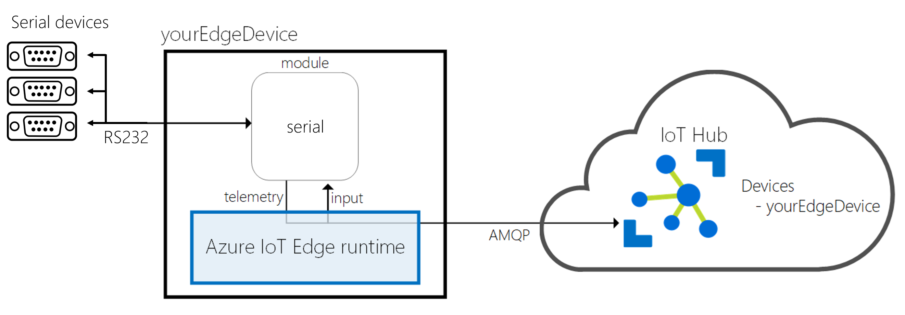

*This project has adopted the [Code of Conduct](CODE_OF_CONDUCT.md) from Contributor Covenant (https://www.contributor-covenant.org/) For more information contact ```jw + @ + jeeweetje.net``` with any additional questions or comments.*

# Azure IoT Edge Serial Module
**Azure IoT Edge Serial Port (RS232) Communication module for Linux & Windows**

Using this module, developers can build Azure IoT Edge solutions with Serial (RS232) Port (the module is currently not available in Windows environment, please use Linux host + Linux container to play with the module) connectivity. The Serial module is an Azure IoT Edge module, capable of reading data from serial port devices and publishing data to the Azure IoT Hub via the Edge framework. Developers can modify the module tailoring to any scenario.



There are prebuilt Serial module container images ready at [here]() for you to quickstart the experience of Azure IoT Edge on your target device or simulated device.

Visit http://azure.com/iotdev to learn more about developing applications for Azure IoT.

## Azure IoT Edge Compatibility
Current version of the module is targeted for the [Azure IoT Edge GA](https://azure.microsoft.com/en-us/blog/azure-iot-edge-generally-available-for-enterprise-grade-scaled-deployments/).

Find more information about Azure IoT Edge at [here](https://docs.microsoft.com/en-us/azure/iot-edge/how-iot-edge-works).

## Target Device Setup
### Platform Compatibility
Azure IoT Edge is designed to be used with a broad range of operating system platforms. Serial module has been tested on the following platforms:

- ~~Windows 10 Enterprise (version 1709) x64~~
- ~~Windows 10 IoT Core (version 1709) x64~~
- Linux x64
- ~~Linux arm32v7~~

### Device Setup
- [Windows 10 Desktop](https://docs.microsoft.com/en-us/azure/iot-edge/quickstart)
- [Windows 10 IoT Core](https://docs.microsoft.com/en-us/azure/iot-edge/how-to-install-iot-core)
- [Linux](https://docs.microsoft.com/en-us/azure/iot-edge/quickstart-linux)

## Build Environment Setup
Serial module is a .NET Core 2.1 application, which is developed and built based on the guidelines in Azure IoT Edge document. Please follow [this link](https://docs.microsoft.com/en-us/azure/iot-edge/tutorial-csharp-module) to setup the build environment.

Basic requirement:

- Moby or Docker CE
- .NET Core 2.1 SDK

## HowTo Build
In this section, the Serial module we be built as an IoT Edge module.

Open the project in Microsoft Visual Studio Code, and open VS Code command palette (ctrl-shift-p), type and run the command Edge: Build IoT Edge solution. Select the deployment.template.json file for your solution from the command palette.
__*Note: Be sure to check configuration section to properly set each fields before deploying the module.*__

In Azure IoT Hub Devices explorer, right-click an IoT Edge device ID, then select Create deployment for IoT Edge device. Open the config folder of your solution, then select the deployment.json file. Click Select Edge Deployment Manifest. Then you can see the deployment is successfully created with a deployment ID in VS Code integrated terminal. You can check your container status in the VS Code Docker explorer or by run the docker ps command in the terminal.

## Configuration
Before running the module, proper configuration is required. Here is a sample configuration for your reference.

```javascript
"properties.desired": {
        "Device": "<device name>",
        "SleepInterval": "<sleep interval in miliseconds>"
      }
```

Meaning of each field:

- **Device**: Device name/id
- **SleepInterval**: # of miliseconds the thread should sleep
- 
- 

## Module Endpoints and Routing
There are two endpoints defined in Serial module:

- "serialOutput": This is a output endpoint for telemetries. All read operations defined in configuration will be composed as telemetry messages output to this endpoint.
- "serialInput": This is an input endpoint for write commands.

Input/Output message format and Routing rules are introduced below.

### Read from Serial
#### Telemetry Message
Message Properties:

```javascript
# "content-type": "application/edge-serial-json"
```

Latest Message Payload:

```javascript
TODO: Add message code
```

#### Route to IoT Hub
```javascript

```

#### Route to other (filter) modules
```javascript

```

### Write to serial
Serial module use input endpoint "serialInput" to receive commands. Currently it supports writing back to a single message to a serial port.
__*Note: Currently IoT Edge only supports send messages into one module from another module, direct C2D messages doesn't work.*__

#### Command Message
The content of command must be the following message format.

Message Properties:

```javascript
"command-type": "SerialWrite"
```
Message Payload:

```javascript

```

#### Route from other (filter) modules
The command should have a property "command-type" with value "SerialWrite". Also, routing must be enabled by specifying rule like below.

```javascript

```

## HowTo Run
### Run as an IoT Edge module
Please follow [the link](https://docs.microsoft.com/en-us/azure/iot-edge/tutorial-csharp-module) to deploy the module as an IoT Edge module.

#### Configure Serial
In the Container "createOptions" section, enter the following for device mapping.

```javascript
{
  "HostConfig": {
    "Devices": [
      {
        "PathOnHost": "<device name on host machine>",
        "PathInContainer": "<device name in container>",
        "CgroupPermissions": "rwm"
      }
    ]
  }
}
```
