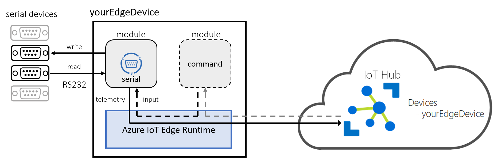

# Azure IoT Edge Serial Module

*This project has adopted the [Code of Conduct](CODE_OF_CONDUCT.md) from Contributor Covenant (https://www.contributor-covenant.org/) For more information contact ```jw + @ + jeeweetje.net``` and ```sander + @ + vandevelde-online.com``` with any additional questions or comments.*

```ascii
   _                         ___      _____   ___     _
  /_\   ___ _  _  _ _  ___  |_ _| ___|_   _| | __| __| | __ _  ___  
 / _ \ |_ /| || || '_|/ -_)  | | / _ \ | |   | _| / _` |/ _` |/ -_)
/_/ \_\/__| \_,_||_|  \___| |___|\___/ |_|   |___|\__,_|\__, |\___|
                                                        |___/
    ___            _        _   __  __          _        _
   / __| ___  _ _ (_) __ _ | | |  \/  | ___  __| | _  _ | | ___
   \__ \/ -_)| '_|| |/ _` || | | |\/| |/ _ \/ _` || || || |/ -_)  
   |___/\___||_|  |_|\__,_||_| |_|  |_|\___/\__,_| \_,_||_|\___|
```

## Azure IoT Edge Serial Port (RS232) Communication module for Linux & Windows

Using this module, developers can build Azure IoT Edge solutions with Serial (RS232) Port connectivity. The Serial module is an Azure IoT Edge module, capable of reading data from and writing data to serial port devices and publishing data to the Azure IoT Hub via the IoT Edge routes. Developers can configure the module tailoring to any scenario.



Prebuilt Serial module container images are available at [https://hub.docker.com/r/jeeweetje/iot-edge-serial](https://hub.docker.com/r/jeeweetje/iot-edge-serial). So you can jump start the serial port experience on your Azure IoT Edge device.

## Azure IoT Edge Compatibility

The current version of the module is targeted for the latest [Azure IoT Edge GA](https://azure.microsoft.com/en-us/blog/azure-iot-edge-generally-available-for-enterprise-grade-scaled-deployments/).

Find more information about Azure IoT Edge at [here](https://docs.microsoft.com/en-us/azure/iot-edge/how-iot-edge-works).

Visit http://azure.com/iotdev to learn more about developing applications for Azure IoT.

## Target Device Setup

### Platform Compatibility

Azure IoT Edge is designed to be used with a broad range of operating system platforms. Serial module has been tested on the following platforms:

- ~~Windows 10 IoT Enterprise (version 1809) x64~~
- ~~Windows 10 IoT Core (version 1809) x64~~
- Linux x64
- ~~Linux arm32v7~~

### Device Setup

If you are new to developing Azure IoT Edge modules, check out these resources first:

- [Windows 10 Desktop](https://docs.microsoft.com/en-us/azure/iot-edge/quickstart)
- [Windows 10 IoT Core](https://docs.microsoft.com/en-us/azure/iot-edge/how-to-install-iot-core)
- [Linux](https://docs.microsoft.com/en-us/azure/iot-edge/quickstart-linux)

## Build Environment Setup

Serial module is a .NET Core 2.1 application, which is developed and built based on the guidelines in the Azure IoT Edge documentation. Please follow these links to setup a [Windows](https://docs.microsoft.com/en-us/azure/iot-edge/tutorial-develop-for-windows) or [Linux](https://docs.microsoft.com/en-us/azure/iot-edge/tutorial-develop-for-linux) build environment.

Basic requirements:

- Docker CE or Moby (Linux only)
- .NET Core 2.1 SDK
- Visual Studio Code

## How to build

In this section, the Serial module will be built as an IoT Edge module.

### Build your own module

Open the project in Microsoft Visual Studio Code, and open the VS Code command palette (ctrl-shift-p), type and run the command 'Azure IoT Edge: Build IoT Edge solution'. Select the deployment.template.json file for your solution from the command palette.
__*Note: Be sure to check configuration section to properly set each fields before deploying the module.*__

### Deploy your module

In Azure IoT Hub Devices explorer, right-click an IoT Edge device ID, then select Create deployment for IoT Edge device. Open the config folder of your solution, then select the deployment.json file. Click Select Edge Deployment Manifest. Then you can see the deployment is successfully created with a deployment ID in VS Code integrated terminal. You can check your container status in the VS Code Docker explorer or by run the docker ps command in the terminal.

## Configuration

Before running the module on an IoT Edge, proper configuration is required. Here is a sample configuration for your reference.

```javascript
"serial": {
  "properties.desired": {
    "portConfigs": {
      "ttyS0": {
        "device": "/dev/ttyS0",
        "direction": "Read",
        "sleepInterval": 1,
        "baudRate": 115200,
        "parity": "None",
        "dataBits": 8,
        "stopBits": "One",
        "delimiter": "\n",
        "ignoreEmptyLines": true
      },
      "ttyS1": {
        "device": "/dev/ttyS1",
        "direction": "Write",
        "sleepInterval": 10,
        "baudRate": 4800,
        "parity": "None",
        "dataBits": 8,
        "stopBits": "One",
        "delimiter": "\r\n",
        "ignoreEmptyLines": false
      }
    }
  }
}  
```

Meaning of each field:
- **portConfigs**: Array of port configurations, size 1 to n
    - **&lt;named port&gt;**: Named port like 'ttyS0' and 'ttyS1' in the example above
        - **device**: Device like /dev/tty... as string. (*Note:* Has to resemble the 'PathInContainer' create option)
        - **direction**: To read from or write to the devicePossible values: Read or Write.
        - **sleepInterval**: # of milliseconds the thread should sleep as integer
        - **baudRate**: # of bauds as integer
        - **parity**: Parity; with possible values: None, One, as string
        - **dataBits**: # number of data bits as integer
        - **stopBits**: Stop bits with possible values: as string
        - **delimiter**: Delimiter to separate data into messages as string
        - **ignoreEmptyLines**: Ignore empty lines in input data as boolean

Naming convention for &lt;named port&gt; is to use the device name as used in the operating system, like 'ttyS0' on Linux or 'COM1' on Windows for the first serial port.

Input data length is limited to 1024 bytes. This is to prevent timeouts due to not recognized delimiters in the input stream. After 1024 bytes a warning message is logged. This exception is treated as an empty line.

For more about the RS232 standard, please refer to the [Wiki](https://en.wikipedia.org/wiki/RS-232) link.

## Module Endpoints and Routing

There are multiple endpoints defined in Serial module dynamically:

- &lt;named port&gt; defined in portConfigs: This is an output endpoint for telemetries per configured port. The operation defined in the direction field of the named port will be dynamically instantiated as telemetry messages output.

There is one input defined:

- "serialInput": This is an input endpoint for write commands for all named ports.

Input/Output message formats and routing rules are introduced below.

### Read from Serial

We read data from serial ports.

#### Telemetry Message

Message Properties:

```javascript
# "content-type": "application/edge-serial-json"
```

Latest Message Payload:

```javascript
{
    "port":"ttyS0",
    "data":"<data>",
    "timestampUtc":"2019-01-01T01:01:00.0000000Z",
}
```

*Note*: the 'data' is a UTF-8 string.

#### Route to IoT Hub

```javascript
"routeToIoTHub": "FROM /messages/modules/serial/outputs/ttyS0 INTO $upstream"
```


#### Route to other (filter) modules

```javascript
"routeToModule": "FROM /messages/modules/serial/outputs/ttyS0 INTO BrokeredEndpoint(\"/modules/[target module name]/inputs/input1\")"
```


### Write commands to serial port

This module supports for writing to a port:

1. An input endpoint "serialInput" to receive commands. This is used in combination with an other module using IoT Edge routes.
2. Direct Methods called "serialWrite" can be used for Cloud to Device messaging.

Both solutions support writing back a single data message to a single serial port.

#### Command Message

The content of the message must follow this message format:

```javascript
{
    "port" : "ttyS0",
    "data":"<your data to write to serial>"
}
```

*Note*: the 'data' is decode as UTF-8 string.

#### Route from other (filter) modules

The command should have a property "command-type" with value "SerialWrite". Also, routing must be enabled by specifying rule like below.

```javascript
"commandSourceToSerialWrite": "FROM /messages/modules/[source module name]/outputs/output1 INTO BrokeredEndpoint(\"/modules/serial/inputs/serialInput\")"
```


## How to run

### Run as an IoT Edge module

Please follow [the link](https://docs.microsoft.com/en-us/azure/iot-edge/tutorial-csharp-module) to deploy the module as an IoT Edge module.

#### Configure create options

In the Container "createOptions" section, enter the following for device mapping.

```javascript
{
  "HostConfig": {
    "Devices": [
      {
        "PathOnHost": "<device name on host machine>",
        "PathInContainer": "<device name in container>",
        "CgroupPermissions": "rwm"
      },
      {
        "PathOnHost": "<device name on host machine>",
        "PathInContainer": "<device name in container>",
        "CgroupPermissions": "rwm"
      }
    ]
  }
}
```

Replace ```<device name on host machine>``` with the actual serial device like '/dev/ttyS0' or /dev/rfcomm0.
The 'PathInContainer' create option has to resemble the desired property 'device'.
Define as much devices as you need.

#### Environment variables

For debugging purposes an environment variable is supported for more logging:

```
RuntimeLogLevel = debug|info
````

#### Access for read/write on serial ports

Elevated rights are needed for access to serial ports. If your serial port is named eg. '/dev/ttyS0' use:

```bash
# chmod 666 /dev/ttyS0
``````

__* Note: This setting must survive a reboot of the host machine!*__

Using Ubuntu, one way to persist elevated rights is using a file named /etc/rc.local with this content:

```bash
#!/bin/bash
sudo chmod 666 /dev/ttyS0
exit 0
```

After saving this file, perform:

```bash
# chmod 777 /etc/rc.local
```

Please reboot your machine so these changes can be applied.

## Supported hardware

We test our module on actual hardware. 

The following Azure IoT Edge devices are used to test the module: 

- Advantech Uno 2271G
- Advantech Uno 2372G
- Advantech Uno 1372G

The following serial devices are used to test the module:

- [Null](https://en.wikipedia.org/wiki/Null_modem) modem
- Moxa NPort 5210A Serial 2 Port Device Server with Null Modem
- BEITIAN USB GNSS GPS Receiver BN-85U (U-Blox UBX-M8030)
- Webio GRB-288 Bluetooth GPS mouse
- GSpace GS-R238 GPS mouse (SiRFstarIII)

*Note*: If you want to have your serial device tested, listed and officially supported here, please send us a DM on github

## Current limitations

Due to the fact the module is still being developed and tested, there are certain limitations to the module.

- only available in Linux environments, please use Linux host + Linux container to play with the module.
- Data transferred is handled as UTF-8 strings currently.
- A &lt;named port&gt; is considered as being uni-directional. For bi-directional communication in Linux two &lt;named port&gt;s are offered for two serial connections to a single tty device.
- Bluetooth devices with serial port support will work. But Bluetooth serial ports are not persisted so both reuse of the same portname and reuse of elevated rights not not garanteed.

## Acknowledgement

The serial reader/writer is based on the [Microsoft Modbus module](https://github.com/Azure/iot-edge-modbus).

The routing images are produced with the [IoT Edge Module Flow generator](https://iotedgemoduleflow.azurewebsites.net/).

## Contribute

The code of this module is open-sourced and licenced under the MIT license.

Want to contribute? Throw us a pull request....
